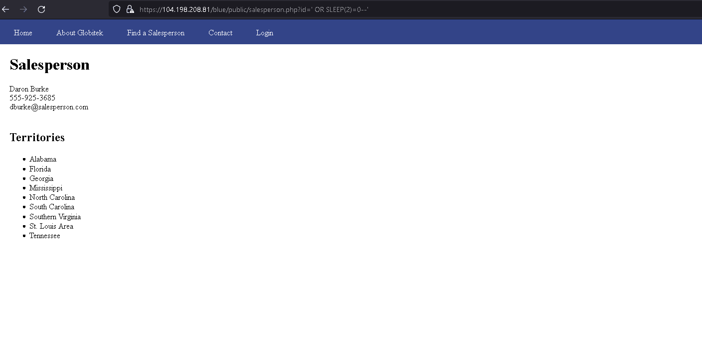

# Pen Testing Live Targets

For this assignment, you will attack three live targets, each of which is a slightly modified version of the same web application, Globitek. The three targets are therefore mostly identical. However, each target has been given a different color menu bar—blue, green, red—and each one has two different security vulnerabilities.

Time spent: **4** hours spent in total

> Objective: Identify vulnerabilities in three different versions of the Globitek website: blue, green, and red.

The six possible exploits are:

* Username Enumeration
* Insecure Direct Object Reference (IDOR)
* SQL Injection (SQLi)
* Cross-Site Scripting (XSS)
* Cross-Site Request Forgery (CSRF)
* Session Hijacking/Fixation

Each color is vulnerable to only 2 of the 6 possible exploits. First discover which color has the specific vulnerability, then write a short description of how to exploit it, and finally demonstrate it using screenshots compiled into a GIF.

## Blue

Vulnerability #1: SQL Injection (SQLi)

+ Using a short SQL command, we are able to manipulate the URL and inject a simple sleep command. 

## Green

Vulnerability #1: Username Enumeration

+ When you log in, we can tell if a username exists in the database by the font change. If the username is valid, it becomes bold. If it's invalid, it stays normal.

## Red

Vulnerability #1: Insecure Direct Object Reference (IDOR)

+ We can insert numbers into the salesperson ID in the URL to access pages that are not normally accessible from the main menu. Entering  10 or 11 shows details of former employees who were terminated.

## Notes 

This was more simple than I thought, although it was time cosuming to be looking around the code for exploits. Seeing the bigger picture was much easier in the scheme of things.

